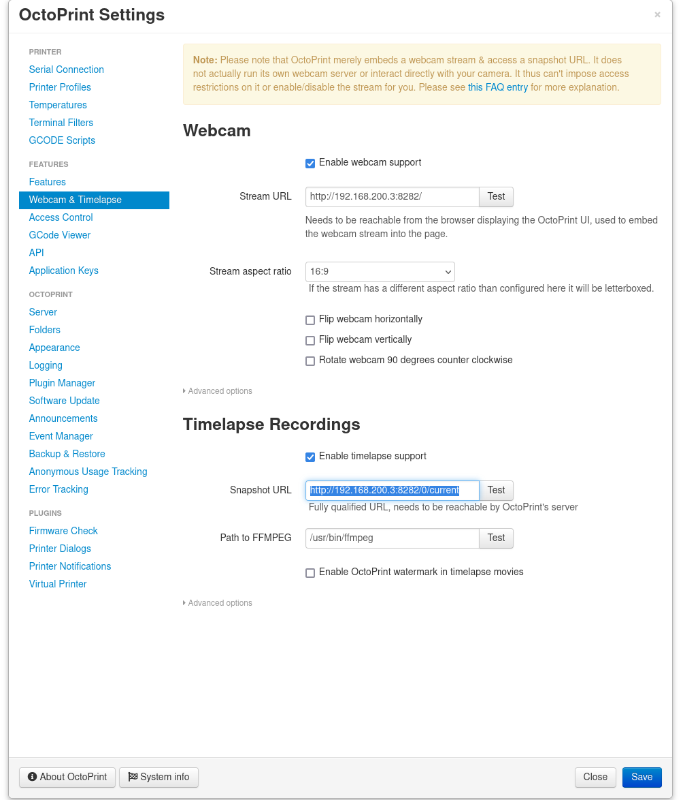

# Using Motion for 1080p 60fps webcam/timelapse on Logitech c920

1. `sudo apt-get install motion v4l2-ctl -y`
2. `nano ~/.motion/motion.conf`
3. Contents of motion.conf:
    ```
    stream_quality 100
    stream_maxrate 100
    stream_port 8282
    stream_localhost off
    output_pictures off
    ffmpeg_output_movies off
    framerate 60
    ffmpeg_video_codec hevc
    width 1920
    height 1080
    ```
4. Run: 
    ```
    v4l2-ctl -d /dev/video0 --set-ctrl=auto_exposure=1 && v4l2-ctl -d /dev/video0 --set-ctrl=exposure_time_absolute=400 && v4l2-ctl -d /dev/video0 --set-ctrl=exposure_dynamic_framerate=0 && v4l2-ctl -d /dev/video0 --set-ctrl=focus_automatic_continuous=0 && v4l2-ctl -d /dev/video0 --set-ctrl=focus_absolute=60
    ```

5. Start motion: `motion &`

6. Webcam stream will be at <host IP>:8282. To make Octoprint use it as the timelapse put the following in OctoPrint Settings > Webcam & Timelapse > Under "Timelapse Recordings"

